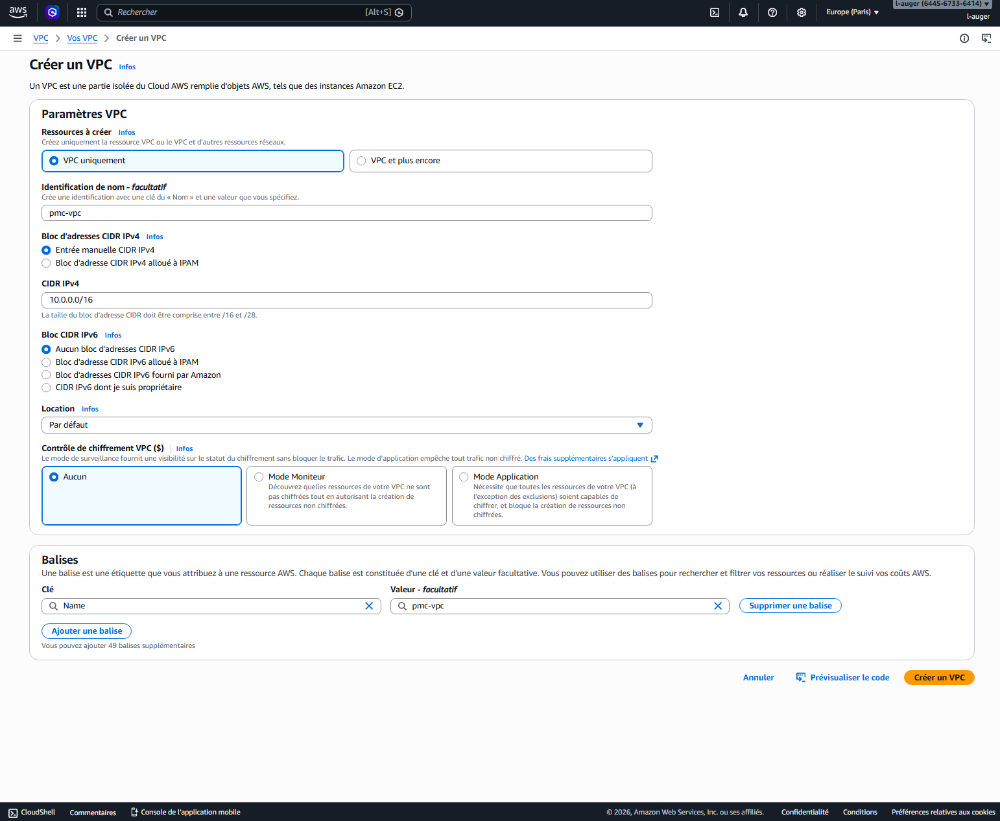

# 🧱 VPC Setup — Cloud-Projet-01

---

## 🎯 Objectif

L’objectif de cette étape est de créer un réseau privé isolé dans AWS afin de servir de base à l’infrastructure.

Le VPC (Virtual Private Cloud) permet de simuler un environnement réseau similaire à un datacenter traditionnel.

---

## 🏗️ Création du VPC

Le VPC a été créé avec les paramètres suivants :

- **Nom** : pmc-vpc 
- **CIDR** : 10.0.0.0/16  
- **Type IP** : IPv4 uniquement  
- **Tenancy** : Default  

Ce CIDR permet de disposer d’un espace d’adressage suffisant pour créer plusieurs sous-réseaux.

---

## 🌐 Rôle du VPC

Le VPC représente :

- Un **réseau privé isolé dans le cloud AWS**
- Une base pour la segmentation réseau (subnets)
- Un environnement contrôlé pour déployer des ressources (EC2, services, etc.)

---

## 🧠 Concepts importants

- Le VPC est équivalent à un **réseau d’entreprise**
- Il permet de définir une plage IP interne (comme en on-premise)
- Toutes les ressources AWS seront déployées à l’intérieur de ce réseau

---

## 📸 Capture

---

## ✅ Résultat

Le VPC est maintenant créé et prêt à accueillir :

- des subnets publics et privés
- des instances EC2
- des composants réseau (route tables, gateways)

Cette étape constitue la base de toute l’architecture cloud.