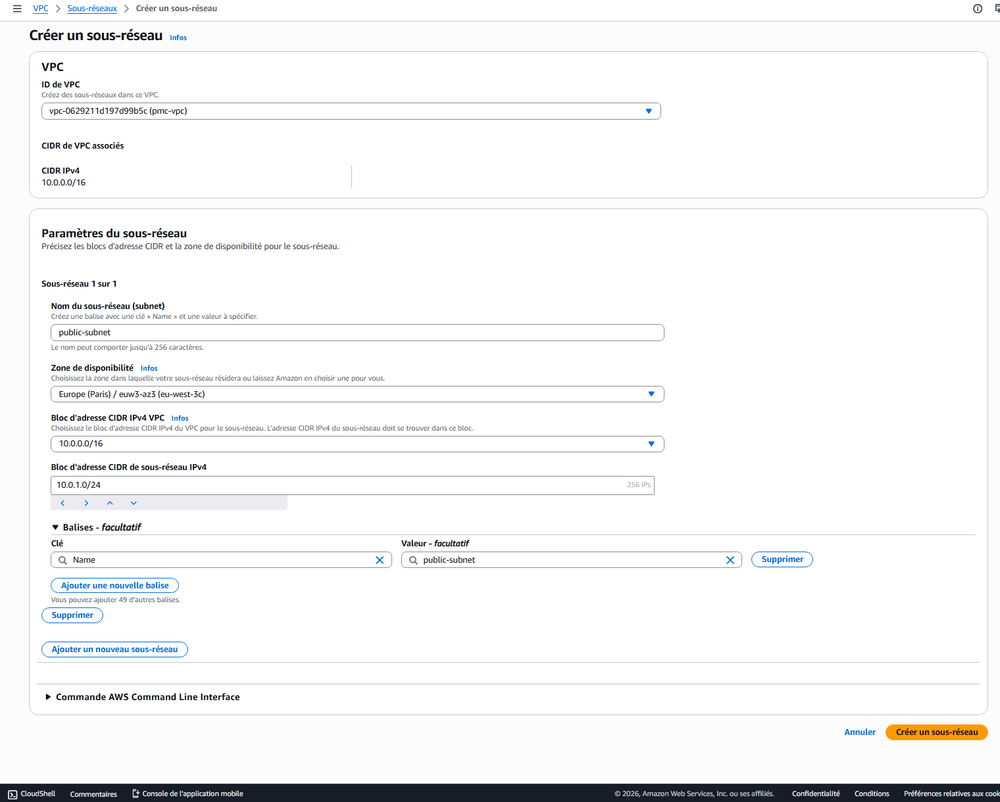
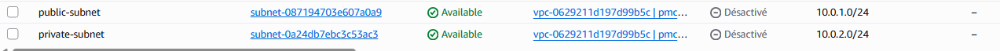
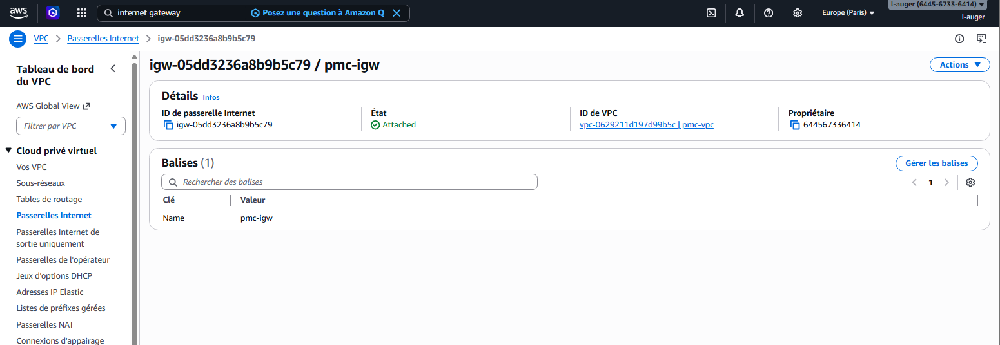
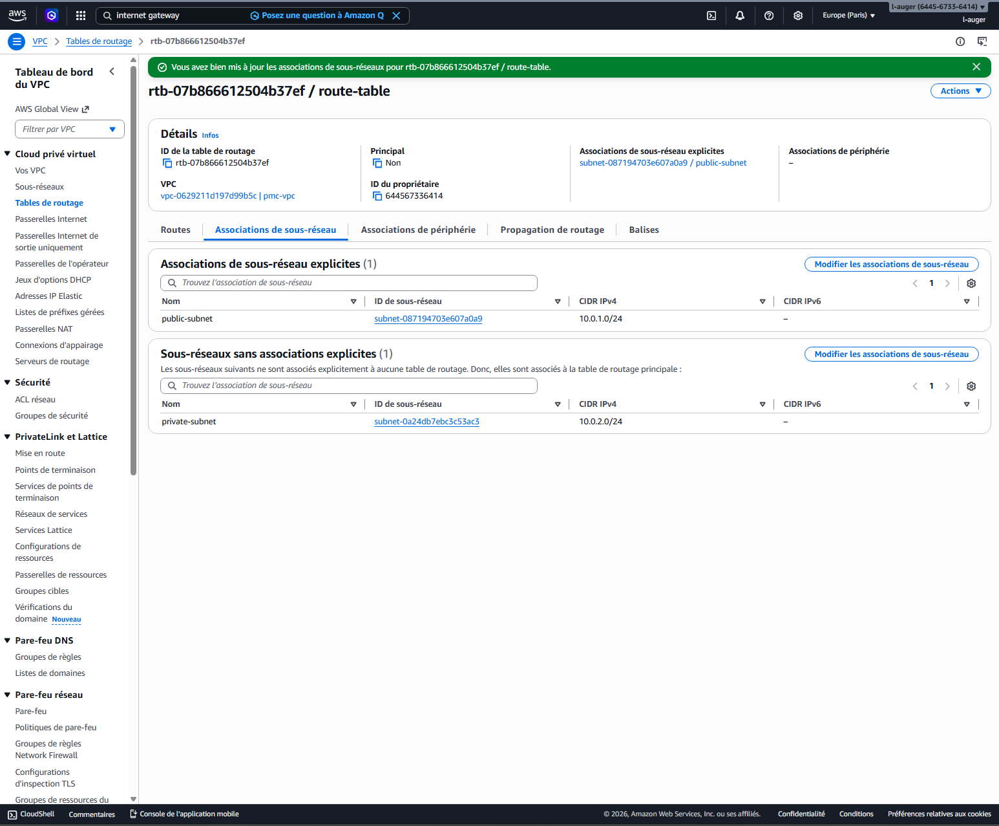

# 🌐 Subnets & Route Table — Cloud-Projet-01

---

## 🎯 Objectif

L’objectif de cette étape est de segmenter le réseau du VPC en plusieurs zones afin de séparer les ressources exposées à Internet des ressources internes.

Cette segmentation est essentielle pour appliquer des règles de sécurité et contrôler les flux réseau.

---

## 🧱 Création des Subnets

Deux sous-réseaux ont été créés dans le VPC :

### 🟩 Subnet public

- **Nom** : public-subnet  
- **CIDR** : 10.0.1.0/24  
- **Rôle** : héberger les ressources accessibles depuis Internet (ex : serveur web, bastion)

---

### 🟦 Subnet privé

- **Nom** : private-subnet  
- **CIDR** : 10.0.2.0/24  
- **Rôle** : héberger les ressources internes non exposées (ex : serveur applicatif)

---

## 🧠 Concept clé

- Le subnet public permet une **connexion à Internet**
- Le subnet privé reste **isolé et non accessible directement**

Cette séparation permet de limiter les risques de sécurité.

---

## 🌍 Internet Gateway

Une **Internet Gateway (IGW)** a été créée et attachée au VPC.

### 🎯 Rôle :
- Permettre aux ressources du subnet public d’accéder à Internet
- Autoriser les connexions entrantes vers les ressources exposées

---

## 🧭 Route Table

Une route table a été configurée pour le subnet public.

### 🔧 Configuration :

- Destination : `0.0.0.0/0`
- Cible : Internet Gateway

### 🔗 Association :
- Associée au **public-subnet**

---

## 🧠 Fonctionnement

Grâce à cette configuration :

- Les ressources dans le subnet public peuvent :
  - accéder à Internet
  - être accessibles depuis Internet

- Les ressources dans le subnet privé :
  - Les ressources du subnet privé ne disposent d’aucune route vers Internet
  - restent isolées garantissant leur isolation complète

---

## 📸 Captures

### Subnets

---

### Internet Gateway

---

### Route Table

---

## ✅ Résultat

- Réseau segmenté en public / privé
- Accès Internet uniquement pour le subnet public
- Isolation du subnet privé respectée

Cette configuration permet de reproduire une architecture sécurisée utilisée en entreprise.
