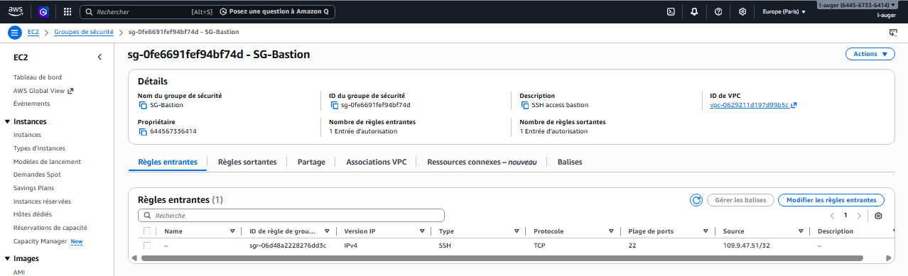
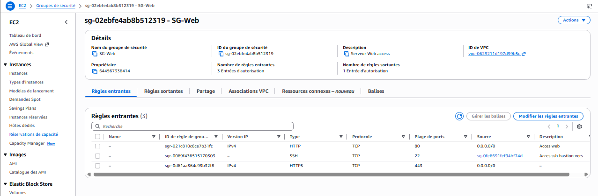
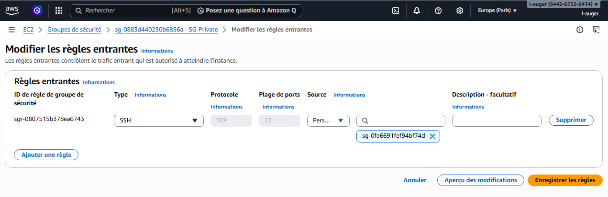

# 🔐 Security Groups — Cloud-Projet-01

## 🎯 Objectif
Sécuriser les accès aux différentes instances de l’infrastructure AWS grâce aux Security Groups, qui jouent le rôle de pare-feux au niveau des instances EC2.

---

## 🧠 Concept clé
Dans AWS :
- Rien n’est autorisé par défaut
- Chaque flux doit être explicitement ouvert
- Les Security Groups contrôlent :
  - les **inbound rules** (trafic entrant)
  - les **outbound rules** (trafic sortant)

---

## 🧱 Architecture des Security Groups

Trois Security Groups ont été créés :

- **SG-bastion** → accès SSH depuis Internet (IP d'un PC autorisé) 
- **SG-web** → accès public HTTP/HTTPS + SSH depuis Bastion
- **SG-private** → accès interne (SSH + API) uniquement depuis les SG autorisés

---

## 🟢 SG-bastion

### 🎯 Rôle
Permettre un accès SSH sécurisé depuis Internet vers le Bastion Host.

### 🔐 Règles

**Inbound**
- SSH (22) → depuis mon IP uniquement

**Outbound**
- Tout trafic autorisé (par défaut)

---

## 🟡 SG-web

### 🎯 Rôle
Permettre l’accès public au serveur web et autoriser l’administration via le Bastion.

### 🔐 Règles

**Inbound**
- HTTP (80) → `0.0.0.0/0`
- HTTPS (443) → `0.0.0.0/0`
- SSH (22) → depuis **SG-bastion**

⚠️ Important :
- ❌ Aucun SSH direct depuis Internet
- ✔ Administration uniquement via le Bastion

**Outbound**
- Tout trafic autorisé

---

## 🔴 SG-private

### 🎯 Rôle
Protéger l’instance privée (App Server) en limitant strictement les flux autorisés.

### 🔐 Règles

**Inbound**
- SSH (22) → depuis **SG-bastion**
- API interne (8080) → depuis **SG-web**

👉 Le Bastion sert uniquement à l’administration (SSH)  
👉 Le Web Server est le seul autorisé à accéder à l’API interne  
👉 Aucun autre flux n’est autorisé

**Outbound**
- Tout trafic autorisé

---

## 🔄 Fonctionnement global

Grâce à cette configuration :

- ✔ SSH depuis Internet → uniquement vers le Bastion
- ✔ Web Server accessible publiquement en HTTP/HTTPS
- ✔ App Server totalement isolé d’Internet
- ✔ Flux interne contrôlé :
  - Bastion → Web Server (SSH)
  - Bastion → App Server (SSH)
  - Web Server → App Server (API 8080)

👉 Toute autre tentative d’accès est refusée.

---

## 🧠 Point important

L’utilisation d’un Security Group comme source (ex : `SG-bastion → SG-private`) permet :

- Une relation de confiance entre instances
- Une sécurité indépendante des IP
- Un contrôle précis des flux internes
- Une architecture conforme aux bonnes pratiques AWS

---

## 🧩 Problème rencontré

### ❌ Symptôme
Tentative d’accès SSH direct depuis le Web Server vers l’instance privée échouée.

### 🔍 Cause
- Aucune règle SSH autorisant ce flux
- Isolation normale du subnet privé
- Compréhension initiale incomplète des Security Groups

### 🛠️ Solution
- Création d’un SG dédié au Bastion
- Autorisation du SSH uniquement depuis `SG-bastion`
- Mise en place d’un accès indirect sécurisé via le Bastion

---

## 📸 Captures

### SG-bastion

### SG-web

### SG-private

---

## ✅ Résultat

- Accès SSH sécurisé et centralisé
- Isolation complète de l’instance privée
- Réduction de la surface d’attaque
- Architecture conforme aux bonnes pratiques cloud

---

## 🚀 Conclusion
Les Security Groups assurent la sécurité globale de l’infrastructure en contrôlant finement les flux réseau entre les différentes couches de l’architecture.
