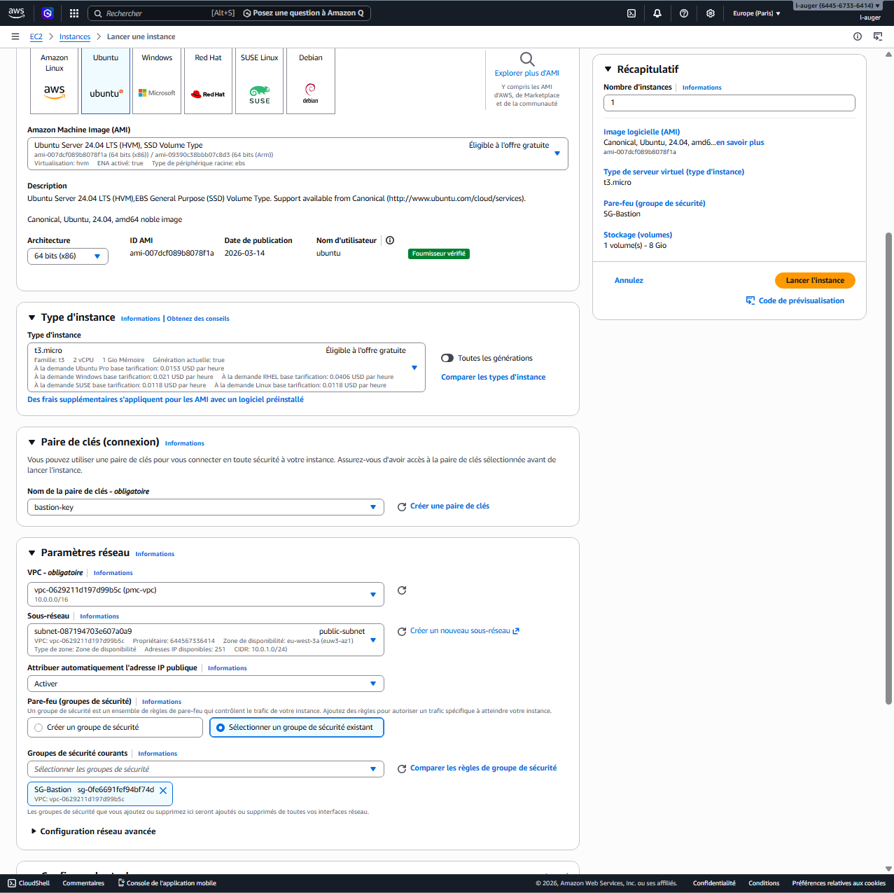
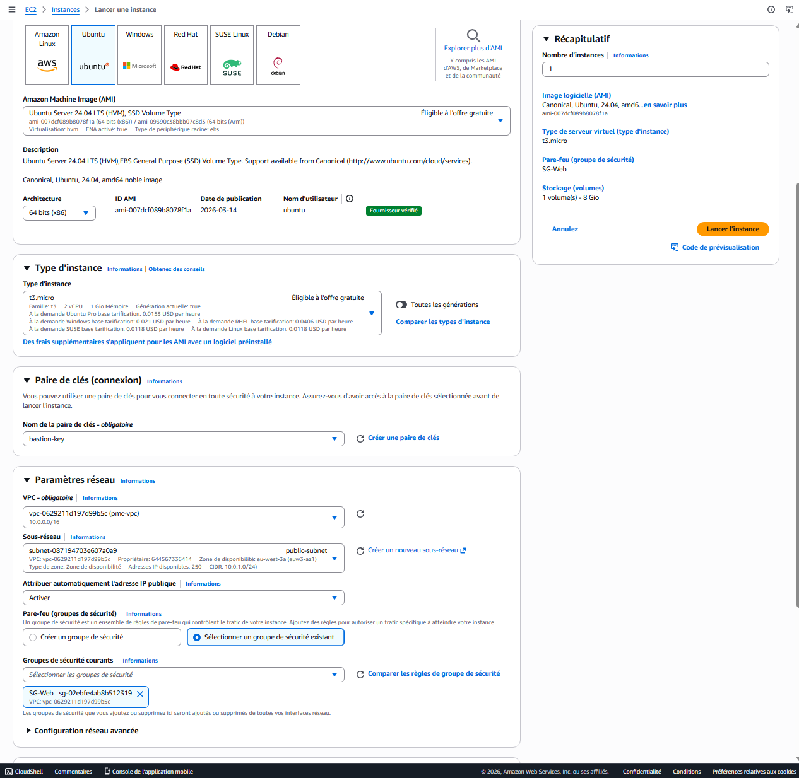
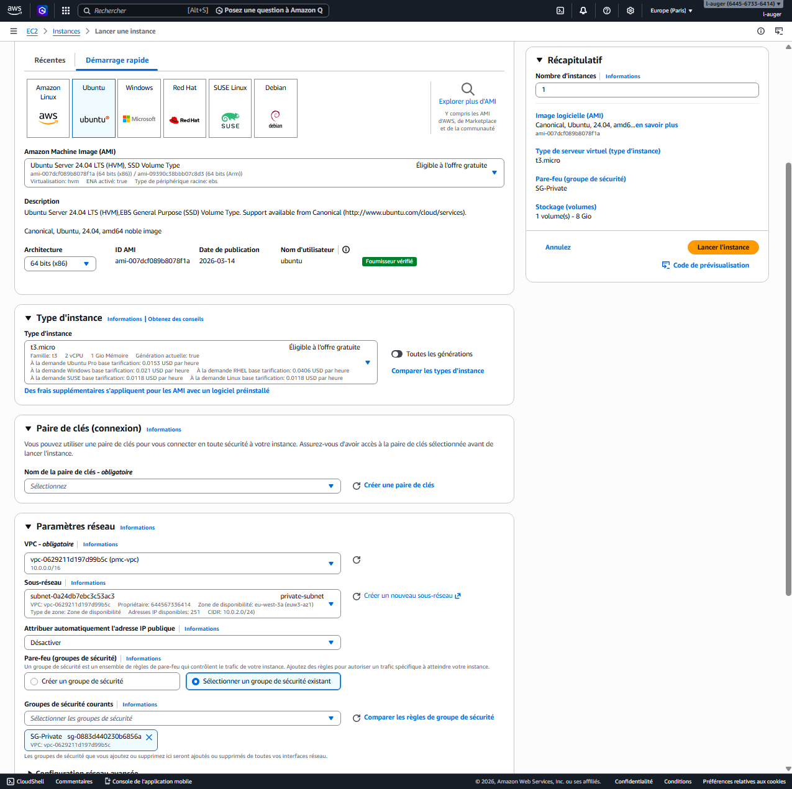
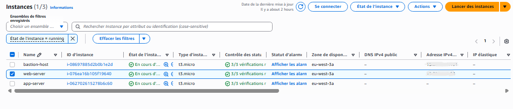

# 🖥️ EC2 Deployment — Cloud-Projet-01

---

## 🧱 Instances EC2 déployées

---

## 🟢 Bastion Host

### ⚙️ Configuration

- **Nom** : bastion-host  
- **Subnet** : public-subnet  
- **IP publique** : activée  
- **Security Group** : SG-bastion  
- **OS** : Ubuntu Server 22.04
  

---

## 🟡 Web Server

### ⚙️ Configuration

- **Nom** : web-server  
- **Subnet** : public-subnet  
- **IP publique** : activée  
- **Security Group** : SG-web  
- **OS** : Ubuntu Server 22.04
  

---

## 🔴 App Server (Private)

### ⚙️ Configuration

- **Nom** : app-server  
- **Subnet** : private-subnet  
- **IP publique** : désactivée  
- **Security Group** : SG-private  
- **OS** : Ubuntu Server 22.04  

---

## 🧠 Résumé

- 🟢 Bastion : accès SSH sécurisé
- 🟡 Web Server : exposé publiquement
- 🔴 App Server : totalement isolé en réseau privé

  
