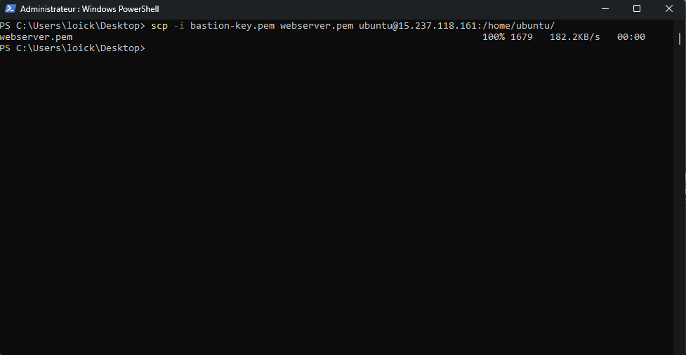

# 🔐 SSH Access Test — Cloud-Projet-01

---

## 🟢 1. Accès au Bastion Host (depuis Internet)

### 🎯 Objectif

Vérifier que le Bastion est bien le seul point d’entrée accessible depuis Internet.

---

### ⚙️ Ce que j’ai dû faire

- Récupérer la clé privée `bastion-key.pem`
- Vérifier les permissions de la clé
- Me connecter via l’IP publique du Bastion

---

### 💻 Commandes utilisées

```bash
chmod 400 bastion-key.pem
```
```bash
ssh -i bastion-key.pem ubuntu@IP_BASTION
```
## 🧠 Explication

Cet accès fonctionne car :

- le Bastion possède une IP publique  
- le Security Group autorise uniquement mon IP en SSH (port 22)  
- il agit comme point d’entrée vers tout le réseau privé  

---

## 🟡 2. Accès au Web Server (via Bastion uniquement)

### 🎯 Objectif

Accéder au serveur web, qui est totalement privé (sans IP publique).

---

### ⚙️ Ce que j’ai dû faire

- Me connecter d’abord au Bastion  
- Transférer la clé privée du Web Server vers le Bastion  
- Sécuriser la clé sur le Bastion  
- Me connecter au Web Server via son IP privée  

---

### 💻 Étapes réalisées

#### 1. Connexion au Bastion

```bash
ssh -i bastion-key.pem ubuntu@IP_BASTION
```

2. Transfert de la clé Web Server vers le Bastion

Depuis la machine locale :
```bash
scp -i bastion-key.pem webserver-key.pem ubuntu@IP_BASTION:/home/ubuntu/
```



3. Sécurisation de la clé sur le Bastion
```bash
chmod 600 webserver-key.pem
```
4. Connexion au Web Server (depuis Bastion)
```bash
ssh -i webserver-key.pem ubuntu@IP_WEB_PRIVATE
```

## 🧠 Explication

Cet accès fonctionne uniquement via le Bastion car :

- ❌ le Web Server n’a aucune IP publique  
- 🔐 son Security Group autorise uniquement le SSH depuis le SG-bastion  
- 🌍 aucun accès direct depuis Internet n’est possible  

---

## 🔴 3. Accès au App Server (via Bastion)

### 🎯 Objectif

Valider l’accès à l’instance privée applicative totalement isolée.

---

### ⚙️ Ce que j’ai dû faire

- Me connecter au Bastion  
- Utiliser SSH interne vers l’IP privée du serveur applicatif  

💻 Commande utilisée
```bash
ssh ubuntu@IP_APP_PRIVATE
```
## 🧠 Explication

Cet accès fonctionne car :

- le App Server est dans un subnet privé  
- aucune IP publique n’est attribuée  
- seul le Bastion est autorisé via Security Group  

---

## 🧠 Conclusion des tests SSH

✔ Le Bastion est le seul point d’entrée depuis Internet  
✔ Le Web Server est totalement privé (pas d’IP publique)  
✔ Le App Server est isolé et inaccessible directement  
✔ Les accès respectent une architecture **“zero direct access”**

---

## 🚀 Résultat global

Cette configuration garantit :

- 🔐 une sécurité renforcée via Bastion Host  
- 🧱 une segmentation claire entre public et privé  
- 🚫 aucune exposition directe des serveurs internes  
- 🏗️ une architecture conforme aux bonnes pratiques AWS  