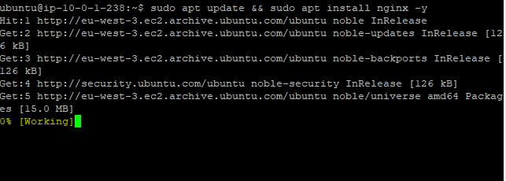
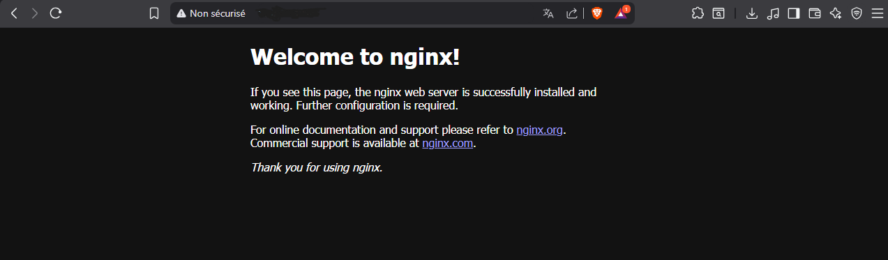

# 🌐 NGINX Setup — Web Server (Cloud-Projet-01)

---

## 🎯 Objectif

Installer et vérifier le bon fonctionnement de NGINX sur le Web Server afin de valider l’exposition du service HTTP.

---

## 🧱 Contexte

Le Web Server fait partie de l’architecture suivante :

- 🟢 Accessible uniquement via le Bastion
- 🔴 Aucune IP publique
- 🌐 Service web exposé en HTTP (port 80)

---

## ⚙️ Installation de NGINX

### 📦 Mise à jour des paquets

```bash
sudo apt update
```
Installation de NGINX
```bash
sudo apt install nginx -y
```

### 🔍 Vérification du service

```bash
sudo systemctl status nginx
```

### 🚀 Accès au serveur web

- Une fois NGINX installé, le service est accessible sur le port 80.

Accès via navigateur :
```bash
http://IP_PRIVATE_WEBSERVER
```

## 📸 Preuves d’installation

### 🔧 Installation de NGINX


### 🌍 Accès au Web Server


## 🧠 Résultat

✔ NGINX correctement installé
✔ Service actif et fonctionnel
✔ Page web accessible via HTTP
✔ Intégration réussie dans l’architecture sécurisée

## 🚀 Conclusion

L’installation de NGINX permet de valider le bon fonctionnement du Web Server dans l’architecture AWS.
Le serveur répond correctement aux requêtes HTTP et est intégré dans un environnement sécurisé sans exposition directe à Internet.
