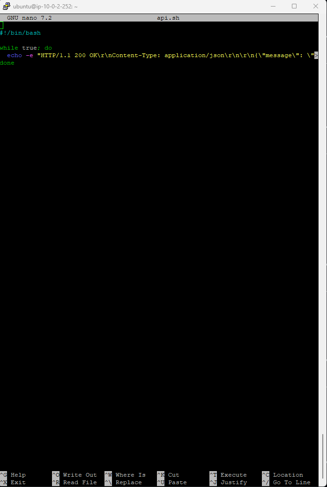
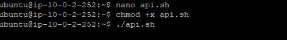
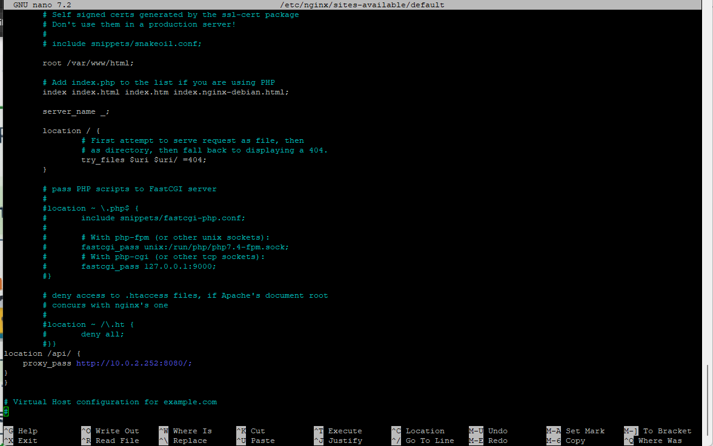

# 🔴 App Server API — Cloud-Projet-01

---

## 🎯 Objectif

Créer une API simple sur l’App Server afin de valider la communication avec le Web Server via le reverse proxy NGINX.

---

## 🧱 Contexte

L’App Server est une instance privée :

- ❌ sans IP publique
- 🔐 accessible uniquement via le Bastion ou le Web Server
- 🔁 exposée indirectement via NGINX (reverse proxy)

---

## ⚙️ 1. Création de l’API

L’API a été créée sur l’App Server afin de simuler un service backend.

---

### 📸 Preuve

---

## 🚀 2. Lancement de l’API

Démarrage de l’API et vérification des permissions nécessaires pour son exécution.

---

### 📸 Preuve

---

## 🔁 3. Configuration dans le Reverse Proxy NGINX

L’API est exposée via le Web Server grâce à la configuration du reverse proxy NGINX.

Le trafic HTTP est redirigé vers l’App Server.

---

### 📸 Preuve

---

## 🧠 Explication

Cette architecture fonctionne car :

- le Web Server agit comme reverse proxy
- les requêtes HTTP sont redirigées vers l’App Server
- l’App Server reste isolé du réseau public
- l’accès est contrôlé via Security Groups et Bastion Host

---

## 🚀 Résultat

- ✔ API fonctionnelle sur l’App Server
- ✔ Communication Web Server → App Server validée
- ✔ Reverse proxy NGINX opérationnel
- ✔ Architecture sécurisée et segmentée

---

## 🏁 Conclusion

L’App Server fournit une API backend accessible uniquement via le Web Server.  
Cela permet de garantir une architecture en couches sécurisée et conforme aux bonnes pratiques cloud.