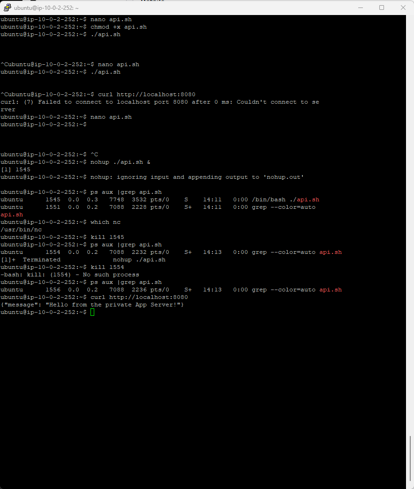
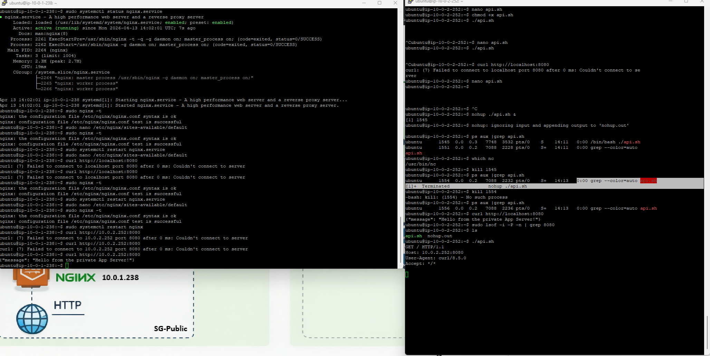
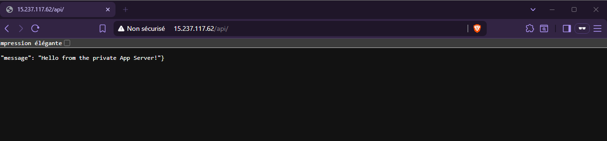

# 🧪 API Tests — Cloud-Projet-01

---

## 🎯 Objectif

Valider le bon fonctionnement de l’API déployée sur l’App Server et vérifier son accessibilité via le reverse proxy NGINX.

---

## 🧱 Contexte

L’API est hébergée sur :

- 🔴 App Server (privé)
- 🟡 Web Server (reverse proxy NGINX)
- 🌍 Accès indirect via HTTP

---

## 🚀 1. Correction / ajustement de l’API

Vérification et ajustement de l’API afin d’assurer son bon fonctionnement dans l’environnement de test.

---

### 📸 Preuve

---

## ✅ 2. Test de fonctionnement de l’API

Validation du bon retour de l’API via le Web Server (reverse proxy NGINX).

---

### 📸 Preuve

---

## 🌐 3. Test global de l’API

Test final de l’API pour confirmer son accessibilité et son bon fonctionnement dans l’architecture complète.

---

### 📸 Preuve

---

## 🧠 Explication

Les tests réussissent car :

- le Web Server redirige correctement les requêtes HTTP
- l’App Server répond correctement sur son port interne
- le reverse proxy NGINX assure la communication entre les couches
- l’architecture réseau est correctement segmentée

---

## 🚀 Résultat

- ✔ API fonctionnelle
- ✔ Communication Web Server → App Server validée
- ✔ Reverse proxy opérationnel
- ✔ Architecture cloud cohérente et sécurisée

---

## 🏁 Conclusion

L’API est pleinement opérationnelle dans l’infrastructure AWS.  
Elle est accessible uniquement via le Web Server, garantissant une exposition sécurisée et contrôlée.