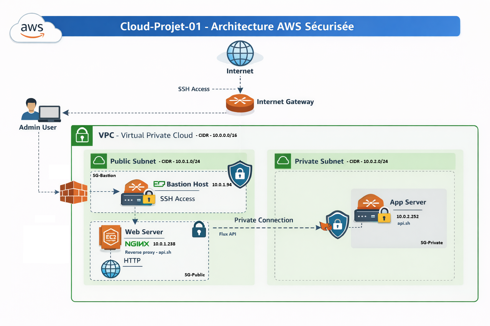

# ☁️ Cloud-Projet-01 — Architecture Cloud AWS sécurisée


---

## 🏗️ Architecture globale



Ce projet simule une infrastructure cloud sécurisée sur AWS, inspirée d’un environnement d’entreprise.

Objectif : comprendre et maîtriser une architecture cloud moderne avec segmentation réseau, bastion, reverse proxy et API interne.

---

## 🎯 Objectif du projet

Ce projet m’a permis de pratiquer et renforcer mes compétences en Cloud Computing à travers la mise en place d’une architecture AWS complète et sécurisée.

Il s’inscrit dans une démarche de préparation aux certifications :
- AZ-900 (Azure Fundamentals)
- AZ-104 (Azure Administrator)

Même si l’infrastructure est réalisée sur AWS, les concepts sont transverses :
- Virtualisation réseau (VPC / VNet)
- Segmentation logique (subnets publics / privés)
- Gestion d’instances virtuelles
- Contrôle des flux réseau
- Sécurisation des accès (Security Groups)
- Administration d’infrastructures cloud

---

## 🧠 Compétences démontrées

- Conception d’architecture cloud sécurisée
- Administration d’un VPC et de sous-réseaux
- Gestion d’instances EC2 (public / privé)
- Configuration avancée de Security Groups
- Mise en place d’un Bastion Host
- Mise en place d’un reverse proxy NGINX
- Déploiement d’une API interne dans un subnet privé
- Analyse et résolution de problèmes réseau (SSH, HTTP, proxy)
- Compréhension des flux réseau en environnement cloud

---

## 🌐 Architecture technique

- VPC : 10.0.0.0/16  
- Subnet public : 10.0.1.0/24  
  - Bastion Host  
  - Web Server (NGINX reverse proxy)

- Subnet privé : 10.0.2.0/24  
  - App Server (API interne sur port 8080)

- Internet Gateway pour l’accès public  
- Security Groups en chaîne :
  - SG-Bastion
  - SG-Public
  - SG-Private

---

## 🔄 Flux réseau détaillé

### 🌍 Accès public
- Client → Web Server (HTTP)

### 👨‍💻 Administration
- Admin → Bastion Host (SSH)
- Bastion → Web Server (SSH)
- Bastion → App Server (SSH)

### 🔁 Flux applicatif interne
- Web Server → App Server (port 8080)

### 🔒 Isolation
- ❌ Aucun accès Internet → App Server
- ❌ Aucun SSH direct → Web Server ou App Server
- ✔ Accès strictement contrôlé via Security Groups

---

## 🔐 Bastion Host

Le Bastion Host est le point d’entrée sécurisé vers le réseau privé.

### Rôle :
- Accès SSH centralisé
- Réduction de la surface d’attaque
- Administration des instances privées

### Sécurité :
- SSH autorisé uniquement depuis mon IP
- Accès aux instances privées uniquement via SG-Bastion
- Principe du moindre privilège

---

## 🌍 Web Server (NGINX + Reverse Proxy)

Le Web Server est accessible publiquement et sert de reverse proxy vers l’API interne.

### Fonctionnalités :
- Serveur web public
- Reverse proxy vers l’App Server
- Isolation du backend
- Aucune logique métier exposée

### Configuration du reverse proxy :
```nginx
location /api/ {
    proxy_pass http://10.0.2.252:8080/;
}
```

## 🧩 App Server (API interne)

L’App Server est totalement privé et héberge une API simple sur le port 8080.

### Caractéristiques :

- Pas d’IP publique  
- Accessible uniquement depuis SG-Public  
- API interne simulée via Bash + netcat  

---

## 🔐 Sécurité mise en place

- Isolation complète via VPC  
- Subnet public / privé  
- Bastion Host obligatoire pour l’administration  
- Reverse proxy pour protéger l’API  
- Security Groups en chaîne  
- Principe du moindre privilège appliqué partout  

---

## 🧪 Tests réalisés

### ✔ Administration
- SSH → Bastion  
- SSH Bastion → Web Server  
- SSH Bastion → App Server  

### ✔ Application
```bash
curl http://localhost/api/
```
## 🔐 Sécurité

- Impossible d’accéder à App Server depuis Internet  
- Impossible d’accéder à Web Server en SSH depuis Internet  

---

## 🖥️ Stack technique

- AWS VPC  
- AWS EC2  
- Internet Gateway  
- Security Groups  
- Bastion Host  
- Ubuntu Server 22.04  
- NGINX (reverse proxy)  
- API interne (Bash + netcat)  
- SSH  

---

## 🔧 Design choices

- Utilisation d’un Bastion Host pour centraliser les accès SSH
- Reverse proxy NGINX pour exposer uniquement un point d’entrée public
- Utilisation de netcat pour simuler rapidement une API
- 
---

## ⚠️ Limitations

- Pas de haute disponibilité (1 instance par rôle)
- Pas de Load Balancer
- Pas de monitoring (CloudWatch non configuré)
- API simulée (non production-ready)

---

## 💰 Cost considerations

- Absence de NAT Gateway pour limiter les coûts
- Architecture volontairement simple (lab pédagogique)

--- 

## 🚀 Améliorations possibles

- NAT Gateway pour mises à jour des instances privées
- Infrastructure as Code (Terraform)
- Load Balancer (ALB)
- Monitoring via CloudWatch
- IAM Roles AWS
- HTTPS via Let’s Encrypt

---

## 📈 Résultat final

- ✔ Serveur web accessible depuis Internet  
- ✔ API interne accessible uniquement via reverse proxy  
- ✔ Instance privée totalement isolée  
- ✔ Accès sécurisé via Bastion Host  
- ✔ Architecture conforme aux bonnes pratiques cloud  
- ✔ Flux réseau maîtrisés et documentés  

---

## 🚀 Améliorations possibles

- NAT Gateway pour mises à jour des instances privées  
- Infrastructure as Code (Terraform)  
- Load Balancer (ALB) pour haute disponibilité  
- Monitoring via CloudWatch  
- IAM Roles AWS  
- HTTPS via Let’s Encrypt  

---

## 📚 Conclusion

Ce projet m’a permis de construire une architecture cloud AWS réaliste, sécurisée et conforme aux bonnes pratiques d’entreprise.

Il démontre ma capacité à :

- concevoir une architecture cloud  
- sécuriser les accès  
- comprendre les flux réseau  
- diagnostiquer et résoudre des problèmes  
- mettre en place un reverse proxy et une API interne  
